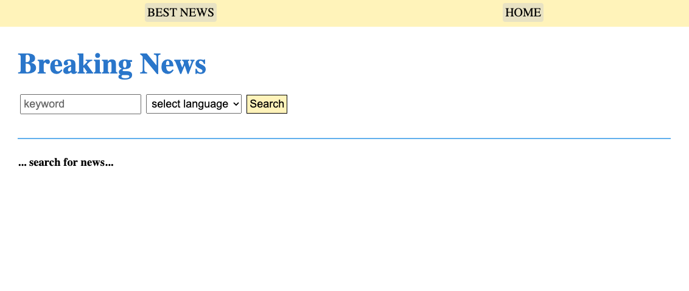
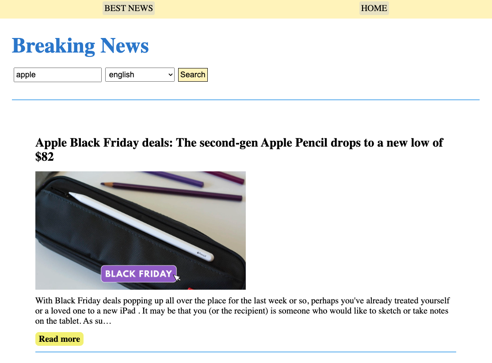
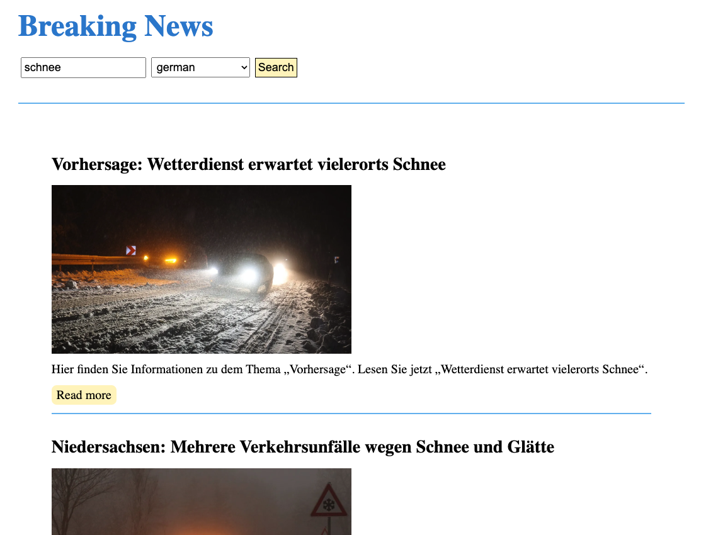
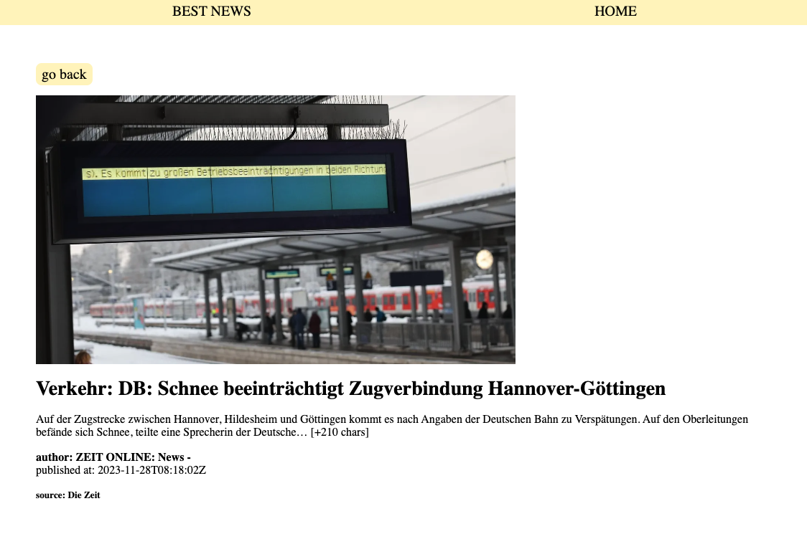

# React-Project: News-API 📰

- This project was created as part of a Full-Stack Webdeveloper bootcamp from supercode.

- The learning objective of the project:

- internalize the handling of useState- and useEffect-hooks in react
- dynamic creation of an api endpoint and fetch based on user input
- the dynamic creation of detail pages using an API and the react npm package: react-router-dom
- hiding the unique api key which is necessary for the news-api to work, but which should not be published on github

## How does the News-Website work?

1. the user can enter a keyword in an input field for which relevant messages should be displayed, and the language in which the messages should be displayed.
2. as soon as the user clicks on the "search" button, the latest news items for the previously defined keyword are displayed.
3. if the user clicks on "read more", he is redirected to a detail page of the article where the user can read the entire article and get more information about it

## Demo Link

in this project i worked with the free developer version of the news-api, therefore the page cannot be deployed. To test my project, you must first clone it and enter your personal API key in line 23 of Home.jsx instead of "import.meta.env.VITE_API_KEY". You can generate the API key via https://newsapi.org/ You can then test the page locally.

## Screenshots 📸

### with empty input fields:

### with keyword and selected language:

### news detail-page:

## Copatible Screensizes

- optimized for desktop use but usable on all screensizes

## Tech Stack 💻

- react
- HTML
- SCSS
- vite
- GitHub
- netlify
- JavaScript
- GIT
- .env
- RESTful API (News API)

## Author 🤵‍♀️

- [@cecilestaller](https://github.com/cecilestaller)

## API-Links

https://newsapi.org/
